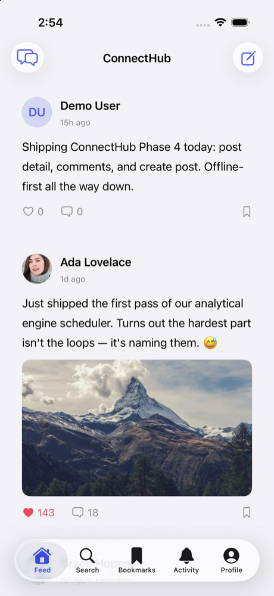
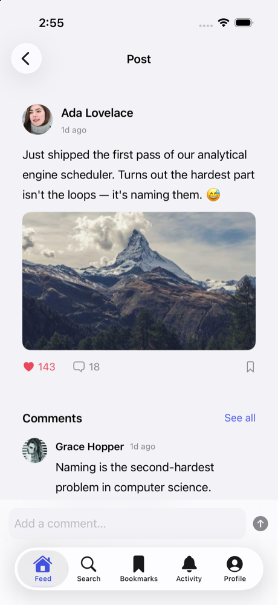
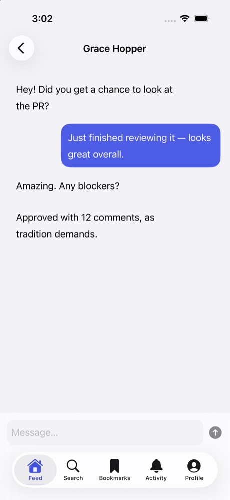
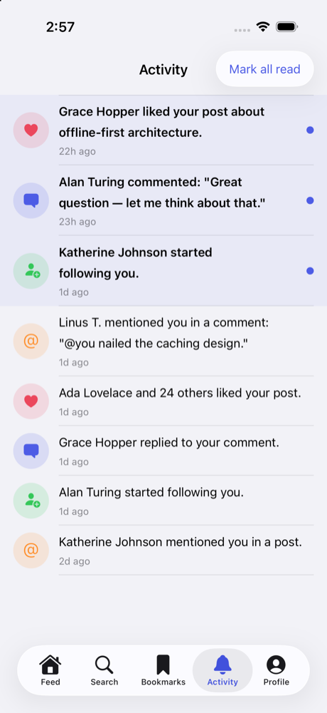
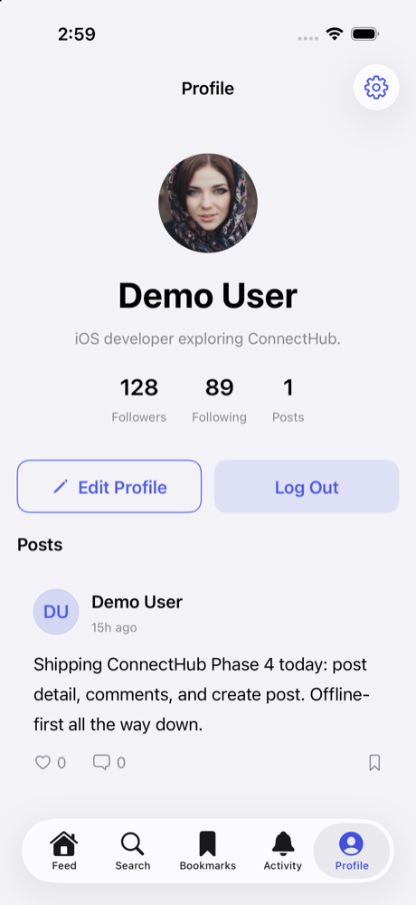
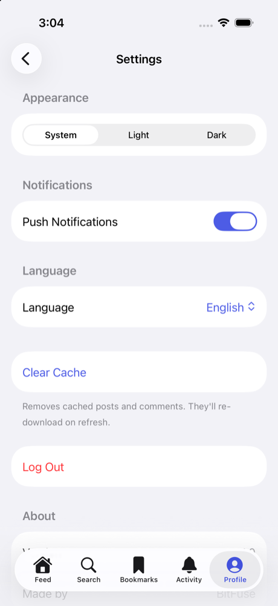

# ConnectHub

A mini social app for iOS — a simplified LinkedIn/Twitter-style feed with messaging — built as a portfolio-quality reference project. ConnectHub is fully offline: there is no real backend. Every network call is served by a fake service layer (bundled JSON + simulated latency) so the app is deterministic, testable, and runnable anywhere.

> **Status:** ✅ **Complete** — built in seven strict, documented phases: foundation, fake auth & session, offline-first feed, post detail + comments + create post, search + bookmarks + profile, actor-backed chat + notifications + settings, and open-source polish. See the [Roadmap](#roadmap) for what each phase delivered and [`docs/`](docs/) for per-phase deep-dives.

---

## Overview

ConnectHub demonstrates a clean, layered SwiftUI architecture with modern Swift 6 concurrency. It is designed to be read as a learning resource as much as run as an app: each layer has a single responsibility, dependencies point inward, and every async surface models its loading / success / empty / error states explicitly.

Planned end-state capabilities:

- Fake authentication with a persisted session (stay signed in across launches)
- A social feed with like, bookmark, comment, and create-post
- Post detail and comment threads
- Debounced search with locally saved recent searches
- Offline-first bookmarks backed by SwiftData
- Notifications with read/unread state
- Real-time-style chat with a simulated reply and typing indicator, backed by a thread-safe `actor`
- Profile / edit profile and app settings (appearance, etc.)

---

## Features by phase

| Phase | Feature area | State |
|------:|--------------|-------|
| 1 | Foundation: design system, DI, navigation, app shell | ✅ Complete |
| 2 | Fake auth + persisted session | ✅ Complete |
| 3 | Feed + fake network + offline cache | ✅ Complete |
| 4 | Post detail, comments, create post | ✅ Complete |
| 5 | Search, bookmarks, profile, edit profile | ✅ Complete |
| 6 | Chat (actor-backed), notifications, settings | ✅ Complete |
| 7 | Open-source polish (docs, CI) | ⏳ Planned |

---

## Tech stack

- **Language:** Swift 6 (Swift 6 language mode, strict concurrency; `MainActor`-by-default isolation)
- **Minimum deployment:** iOS 17.0 · **Toolchain:** Xcode 26
- **UI:** SwiftUI only
- **State/observation:** Observation framework (`@Observable`, `@State`, `@Binding`, `@Environment`)
- **Concurrency:** `async/await`, `Task`, actors, `@MainActor`; Combine/`AsyncStream` reserved for continuous streams (debounced search, typing indicator)
- **Persistence:** SwiftData (default local store), `@AppStorage`/`UserDefaults` behind stores for simple preferences
- **Dependency injection:** protocol-based constructor injection with a single composition root (`AppEnvironment`), exposed via `@Environment`
- **Testing:** Swift Testing with protocol-based fakes (introduced from Phase 2)
- **Dependencies:** none beyond first-party frameworks (SPM only if needed)

---

## Architecture

ConnectHub follows a layered, unidirectional design. Dependencies point inward toward the domain; the UI never talks to data sources directly.

```
┌──────────────────────────────────────────────────────────────┐
│  Feature (SwiftUI Views + @Observable ViewModels)            │
│     observes read-only state · sends intents as methods       │
└───────────────┬───────────────────────────────▲──────────────┘
                │ intents                        │ state
┌───────────────▼───────────────────────────────┴──────────────┐
│  Domain (UseCases, Repository protocols, plain-struct Models) │
└───────────────┬───────────────────────────────▲──────────────┘
                │                                │
┌───────────────▼───────────────────────────────┴──────────────┐
│  Data (Repository impls, Mappers, actor-backed stores)        │
└───────────────┬───────────────────────────────▲──────────────┘
                │                                │
┌───────────────▼───────────────────────────────┴──────────────┐
│  Core (Fake network services + JSON, SwiftData, Stores, DI,   │
│        Design System, Navigation)                             │
└───────────────────────────────────────────────────────────────┘
```

**Data-flow (target shape once features land):**

```
SwiftUI View → @Observable ViewModel → UseCase → Repository
        → SwiftData (source of truth) / Fake API → back up to the View
```

Key rules applied throughout:

1. Views are mostly stateless; they receive state and emit events.
2. View models are `@Observable`, expose read-only state, and receive intents as methods.
3. Repositories hide data sources behind protocols defined in the domain layer.
4. DTO (`Codable`) / persistence (`@Model`) / domain (plain struct) / UI models are separated with mappers.
5. Single source of truth: UI observes local/derived state; the network layer never drives the UI directly.
6. Type-safe navigation via `Route` enums + `navigationDestination`; detail screens are pushed, never tab roots.
7. Every async surface models loading / success / empty / error explicitly.

### Composition root & dependency injection

`AppEnvironment` (in `DI/`) is the single place the object graph is assembled. It is created once in `ConnectHubApp` and injected via `.environment(...)`. In Phase 1 it wires the two foundational stores (`SessionStore`, `SettingsStore`); each later phase extends it with the services, repositories, and use cases that phase introduces.

### Navigation

The root (`RootView`) performs a session check and switches between two fully separate worlds:

- **AuthFlow** — a `NavigationStack` with Login as root and Sign Up pushed via `AuthRoute`.
- **MainFlow** — a five-tab `TabView` (Feed, Search, Bookmarks, Activity, Profile) where each tab is its own `NavigationStack`. A shared `Router` owns per-tab typed paths (`[MainRoute]`) and modal presentation state. Chats and Settings are reached from toolbar entries (iOS-idiomatic — no drawer). Detail screens are pushed via the type-safe `MainRoute` enum; Create Post is a sheet.

---

## Folder structure

```
ConnectHub/
├── App/                # App entry, RootView, Splash, Auth/Main flow coordinators
├── Core/
│   ├── Common/         # AppError and shared utilities
│   ├── DesignSystem/   # Theme (colors/spacing/type) + reusable CH* components
│   ├── Navigation/     # AuthRoute, MainRoute, MainTab, Router
│   ├── Storage/        # SessionStore, SettingsStore
│   ├── Networking/     # (Phase 3+) fake service protocols, fakes, DTOs, JSON
│   └── Persistence/    # (Phase 3+) ModelContainer, @Model types, stores
├── Domain/             # (Phase 2+) Models, Repository protocols, UseCases
├── Data/               # (Phase 2+) Mappers, Repository implementations
├── Feature/            # One folder per screen/feature
│   ├── Auth/ Feed/ PostDetail/ CreatePost/ Comments/ Search/
│   ├── Bookmarks/ Notifications/ ChatList/ ChatDetail/
│   └── Profile/ EditProfile/ Settings/
└── DI/                 # AppEnvironment (composition root)
```

Layers below the `Feature` level are added by the phase that first needs them, so the structure grows honestly rather than shipping empty folders.

---

## How to run

**Requirements:** macOS with Xcode 26 (iOS 17+ SDK).

1. Open `ConnectHub.xcodeproj` in Xcode.
2. Select the **ConnectHub** scheme and any iOS 17+ simulator.
3. Run (⌘R).

Or from the command line:

```bash
xcodebuild -project ConnectHub.xcodeproj -scheme ConnectHub \
  -destination 'platform=iOS Simulator,name=iPhone 17' build
```

On first launch you land on **Login**. Enter any valid-looking email and a 6+ character password to sign in (fake auth — no real backend); the session persists across launches, and **Log Out** (Profile tab) clears it. Signing in with `blocked@connecthub.app` demonstrates the error state. Run the tests with ⌘U or:

```bash
xcodebuild test -project ConnectHub.xcodeproj -scheme ConnectHub \
  -destination 'platform=iOS Simulator,name=iPhone 17'
```

---

## How the fake API / demo data works

Introduced from Phase 3. Each service is a Retrofit-style **protocol** (e.g. `FeedService`) with a `Fake…Service` implementation backed by bundled JSON, decoded with `Codable`, and returned after a simulated `Task.sleep` delay. A `shouldThrowError = false` toggle exercises error paths. The fakes are structured so a real `URLSession` implementation could replace them with no changes to callers.

## How local persistence works

Introduced from Phase 3. **SwiftData** is the source of truth for offline-capable data (feed, bookmarks, messages): the UI observes SwiftData, and the fake API refreshes into the store. Simple preferences (appearance, session) live in `UserDefaults` behind `SettingsStore` / `SessionStore` so views never read `UserDefaults` directly.

### SwiftData → Core Data note

SwiftData is a declarative wrapper over the Core Data stack. Each `@Model` class maps to a Core Data `NSManagedObject` entity; the `ModelContainer` corresponds to an `NSPersistentContainer`, and a `ModelContext` to an `NSManagedObjectContext`. Fetching with `@Query`/`FetchDescriptor` compiles down to `NSFetchRequest`. Because the mental model is the same, this project could be re-implemented on Core Data by swapping the persistence layer without touching the domain or UI.

---

## Testing

ConnectHub uses **Swift Testing** (`@Test`, `#expect`, `#require`) with protocol-based fakes and in-memory `ModelContainer`s — **95 tests across 23 suites**. Coverage includes auth validation, view-model state transitions, use cases (like/bookmark/create/comment), search, the actor-backed message store under 200 concurrent sends, notification read-state, and SwiftData round-trips. See [`docs/TESTING.md`](docs/TESTING.md).

---

## Documentation

- [`docs/PHASE_1_SUMMARY.md`](docs/PHASE_1_SUMMARY.md) — Foundation phase deep-dive
- [`docs/PHASE_2_SUMMARY.md`](docs/PHASE_2_SUMMARY.md) — Fake auth + session deep-dive
- [`docs/PHASE_3_SUMMARY.md`](docs/PHASE_3_SUMMARY.md) — Feed + offline SwiftData cache deep-dive
- [`docs/PHASE_4_SUMMARY.md`](docs/PHASE_4_SUMMARY.md) — Post detail, comments, and create post deep-dive
- [`docs/PHASE_5_SUMMARY.md`](docs/PHASE_5_SUMMARY.md) — Search, bookmarks, and profile deep-dive
- [`docs/PHASE_6_SUMMARY.md`](docs/PHASE_6_SUMMARY.md) — Actor-backed chat, notifications, and settings deep-dive

**Guides:**

- [`docs/ARCHITECTURE.md`](docs/ARCHITECTURE.md) — layers, dependency rule, offline-first & concurrency model
- [`docs/TESTING.md`](docs/TESTING.md) — testing strategy and gotchas
- [`docs/LEARNING_NOTES.md`](docs/LEARNING_NOTES.md) — every iOS/Swift concept, with where to find it
- [`docs/INTERVIEW_NOTES.md`](docs/INTERVIEW_NOTES.md) — interview Q&A grounded in the code
- [`docs/ROADMAP.md`](docs/ROADMAP.md) — completed phases + backlog
- [`docs/SCREENSHOTS.md`](docs/SCREENSHOTS.md) — full visual tour

## Screenshots

| Feed | Post Detail | Chat |
|------|-------------|------|
|  |  |  |

| Activity | Profile | Settings |
|----------|---------|----------|
|  |  |  |

More in [`docs/SCREENSHOTS.md`](docs/SCREENSHOTS.md).

---

## Roadmap

All seven phases are complete — see [`docs/ROADMAP.md`](docs/ROADMAP.md) for the details and the forward-looking backlog.

1. **Foundation** — design system, DI, navigation, app shell ✅
2. **Fake Auth + Session** — login/sign-up, persisted session ✅
3. **Feed + Fake Network + Offline Cache** — post list, like/bookmark, SwiftData ✅
4. **Post Detail + Comments + Create Post** ✅
5. **Search + Bookmarks + Profile** ✅
6. **Chat + Notifications + Settings** — actor-backed messaging ✅
7. **Open-Source Polish** — full docs set + CI ✅

---

## Contributing

Contributions are welcome — see [`CONTRIBUTING.md`](CONTRIBUTING.md) and the [`CODE_OF_CONDUCT.md`](CODE_OF_CONDUCT.md). Security policy: [`SECURITY.md`](SECURITY.md). Release history: [`CHANGELOG.md`](CHANGELOG.md).

## License

Released under the [MIT License](LICENSE).
